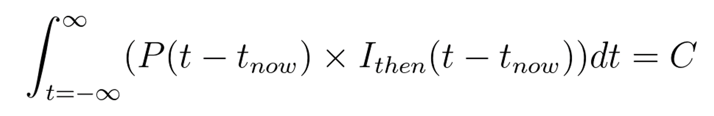

# Removing Unnoticed Infinities in Quantum Mechanics Implies a Physical Mechanism for Waveform Collapse

by g2author, MSEE

## What the author knows and doesn't
I"m a retired electronics engineer and also a lifetime physics addict, so I'm fairly well-versed in what I think of a *time-domain physics*. However, I have not spent years with my head submerged in that horse trough of math which is quantum mechanics, so this little missive is sadly likely to contain one or two divide-by-zero errors that would have been obvious if I knew the wavefront-domain math.

## Time-domain phyaics
Electronic engineering makes routinely switches between time-domain calculations and frequency-domain calculations, and this is a good abstraction for the relationship between the time-domain physics that can perform many useful calculations much more easily than those same calculations can be performed in the wavefront-domain physics of quantum mechanics and vice-versa. I perhaps should mention that time-domain physics can't answer quantum mechanical questions, but it enfolds the great wealth of knowledge---that can be reached via precalculated time-domain results transformed from the wavefront domain.

Because the overlap of results from the two kinds of calculations must be exact wherever it is non-null, it holds that anything impossible in one domain must also be impossible in the other domain in any area of non-null overlap. One obvious impossibility in the time domain of physics is that physically extant information has non-zero mass, and therefore any particle, real or virtual, must not depend on infinite information for its existence.

## The unnoticed infinities

This paper proposes that conservation of information be generalized into the dimension of time so that it includes not only the conservation of instantaneous information, but also conservation of the integral of all extant information&mdash;including predictability and postdictability&mdash;for any given moment in time. The author is calling this conserved integral *causality*. Satisfaction of this new dimension of conservation ensures that the physical universe is able to exist, and forces changes upon quantum mechanics, and perhaps general relativity, which the author suspects will allow the unification of physics.

## This proposal is standard physics
The author wishes to stress that the proposal in this paper is composed entirely of well-established principles of physics and engineering which are based entirely upon intuitively sensible physical processes. The proposed conservation of causality principle derives every feature of its character from a major correction to the conservation of information principle plus the refinements to predicted behavior that are expected and demanded as the result of attempting to integrate a new conservation principle into an already almost perfectly successful framework.

## This proposal arises from a standard scientific technique
It is a standard mathematical technique for exploring strategic spaces that if there exists a predictive framework of nearly perfect success, the chances are excellent that exactly one of the predictive components in your system is missing some vital complexity, which is most simply explained by a missing conservation law which is being only approximated within the current predictive framework.

This proposal suggests that the relevant incorrect approximation in the current view is that instantaneous information is never destroyed, so that information about the past has accumulated somewhere and must be computationally capable of continuing this proliferation of historical information into the infinite future. 

## The contradiction in current quantum mechanics
That is is easily illustrated. Consider that the initial state for each particle in a non-repeating deterministic billiard-ball universe of potentially infinite longevity would have to somehow carry the infinite amount of information required to deterministically define its behavior into the possibly infinite future. Making the impossible-to-avoid assumption that finite information must be represented by some finite mass, the infinite information contained in the initial state of a single particle must be accompanied by infinite mass, rendering this universe impossible.

If this author's understanding is correct, quantum mechanics adds randomness while still preserving the drawback of requiring each particle to somehow represent not just a single past, but all possible pasts as well. The problem is that this still demands an infinite information storage capacity associated with each particle that ever exists, which is again a physical impossibility.

## This paper's limitations
The author of this paper is a retired electronics and software engineer, and their knowledge of general relativity and quantum mechanics is limited to Scientific American and similar publications, which means that this paper's initial standards of domain expertise and academic rigor will be unavoidably low. Please forward any instances of error or relevant priority to the author, who means well but really just doesn't know anything.

## ????????
Limited precision can be a more flexible concept than quantizing. Rather than a number simply terminating as resolution gets smaller, it could terminate in increasing uncertainty over the last few places, terninating in full randomness. This might be guessed to be a mathematically optimal way of packing maximum causative power into minimum mass-energy. However, the method of encoding is orthogonal to the primary point, which is that there may be more than one kind of limited precision, but all kinds will follow the same conservation of (mass-energy)-causality.

## Defining Causality
The traditional way of viewing subatomic particles is in terms of their various parameters, each of which contribute to each particle's mass-energy.

This paper proposes that an additional item be added to the physics toolbox, which is to consider that the entire mass-energy of a subatomic particle can also be considered as a single abstract property we can call *causality*, which is the ability of the particle to affect the future state of the universe, and to allow inference of former states of the universe. These two abilities are the same thing, but described from different time directions.

The concept of causality is equivalent to considering *past* and *future* as properties that a particle possesses just like momentum or charge. 

## Conservation of Causality
Because causality is another view of mass-energy, it is necessarily conserved. This means that each subatomic particle has a fixed amount of past and future. In fact, each subatomic particle *is* a fixed amount of past and future.

This identification of mass-energy with the information it contains implies the very useful constraint that a universe of finite size yet infinite longevity may be created using only a finite amount of information. This is in conflict with quantum mechanics, which requires infinite precision both to define a single particle and during the process of computation which mediates particle interaction. This need for infinite precision is physically absurd, and it leads to absurdities such as endlessly proliferating multiverses, or asking that a single black hole which has somehow swallowed an entire universe must contain not only the particles, but unlimited amounts of those particles' causal history as well.

Universes which violate conservation of causality by maintaining excess history are required to somehow encode information in amounts that are arbitrarily larger than the mass-energy of their constituent particles, and this renders them infinitely implausible compared to a universe which holds only the amount of history and predictability that can be represented in its aggregate mass-energy.

It is worth stressing that causality requires two different ways of thinking about history; causal, and non-causal. Causal history is the history which has the ability to influence the future, and non-causal history is the history which could be seen by an omnicient observer to have happened, yet which has no effect on the present or future. For example, nearly all of the information about the various states of the early universe is non-causal for us in the present. Only the tiny amount of information represented by the microwave background and similar long-lived effects remains.

## The Physical Mechanism for Loss and Creation of Causality

Identifyng causality with a particle's mass energy tells us that the causality of a particle is finite, which implies a fundamental limitation on the result of two particles interacting. This is because the limited mass-energy available to encode causality also implies that the various parameters of the particle are also stored with limited precision. 

If we consider a simple momentum exchange, before the two particles meet, they each have their momentum property stored with limited precision, and after they interact they have differing momenta stored with the same precision.

It is conceivable that if the two particles hit exactly head on (or close enough), there might be no need for non-trivial calculation. Perhaps the two particles could simply swap momenta, which could conceivably be lossless. And its tempting to speculate that a photon reflecting from a mirror at a normal angle might also be lossless. But for the more common case of oblique impact, some kind of computation must take place which takes two limited precision values as input and produces two limited precision values as output. Even with the reasonable assumption that the computation itself can carry excess information in intermediate steps to avoid calculation losses, storing the result into limited precision outputs is an inherently lossy operation. This loss of information is destructive and irreversible.

At the same time that this older information is lost, newer information comes into being in exact balance. The new information is contained in the difference between the new states of the colliding particles and the slightly different new states that would have existed if precision were not limited. The actual new value is now the authority on the state of the universe, and this tiny bit of difference information that is exact by reason of existential auhority is the newer information about the future of the universe which has come into being. The new information will provide more predictability into the future than the older informaiton by this tiny amount.

## A Simple Example
Here is an equation for a monatomic gas in thermal equilibrium. Most practical versions of this equation will be much more complex, but the principle will remain the same.

* *Inow* is the aggregate of all information that is carried by the particles under consideration at time = now. This simplified notion of time disregards the speed of causality.
* *Pavg* is the average fraction of causal information retained in each interaction. This number is slightly less than one due to the loss of precision in the calculation that performs the transformation of particle properties, and can be thought of as *precision* or *predictability/postdictability*.
* *Kavg* is the average number of interactions that each particle experiences per second.
* *P(t - tnow)* is the cumulative fraction of causal information wihch is retained during the interactions within the time interval. It is approximately equal to *Pavg* raised to the power of *(Kavg* &#215; *(t - tnow))*, except that it goes to exactly zero for time distances beyond which the magnitude of the result dips below approximately *(1 - Pavg)*.
* *Ithen(t - tnow)* is all of the information about the moment at time *t* which can be calculated from *Inow* using infinite precision math.
* *C* is the conserved value of causality.

 In equation form, causality is the integral of all extant information about how the universe interacts with itself from time negative infinity to time plus infinity for any given *tnow*. 

 

The author does not know what the dimensionality of terms *Ithen* or *C* should be, but that deficit does not affect the implications of the conserved property.

## Correcting Conservation of Information
If we set *t = t_now*, the resulting equation becomes the standard concept of conservation of information, and we can see that experimental results dealing with smallish numbers of interactions will agree with this simplified system.

It is only when the number of interactions becomes large that conservation of causality starts to impose measurable loss of causality, and therefore information, over time.

## A New Source of Randomness
Those tiny new bits of causality which accrue into the newer state after a particle interaction are a fundamental source of randomness in the physical universe. This information arises only from the way in which subatomic interactions solve the problem of rounding, and we may assume that however the universe does this, it won't involve any of the patterned errors that arise in some base-10 digital calculatons. Parsimony, I belive, insists that the added information will be purely random.

## Rehabilitating Black Holes
Although newer particles contain the same total amount of information as the older source particles, they do *not* contain all of the information in the original particle set. A small piece of the causal past has been lost forever, making the calculation only approximately reversible.

This irreversibility radically redefines the behavior of black holes event horizons as (relatively) simple thermal processes which cheerfully destroy all of the causal history contained in infalling objects, and retain only the infalling mass-energy as stored information.

## Radioactivity
The random loss and gain of past and future provides an explanation for the random nature of radioactivity. The loss of precision in the internal information of an atomic nucleus will be extremely dependendent on the precise paths of the internal interactions. The paths vary randomly, and for a rare number of interaction paths, the loss of precision accumulates to a state where the nucleus "forgets" that it is stable. This also explains why neutrons may be unstable outside of nuclei but stable within; when within a nucleus, the available interaction paths never accumulate enough loss of information to take the neutron outside of its set of stable states. 

It's also tempting to suspect that this process might also underly the flavor changes of neutrinos; their mass-energy contains so little information that small amounts of missing information might manifest in this way.

## Linked Properties
Conservation of causality provides a simple physical interpretation of properties linked by Heisenberg's unccertainty principle such as position and momentum: linked properties share the physical storage of their causality in the particle.

## When Does the Waveform Collapse?
Unconserve instantaneous information suggests that the waveform collapses when the loss of information about the causal past makes the superposition mathematically unsustainable. 

## Next Steps
By providing a path to make quantum mechanics conform to the finite information behavior of real particles and taming event horizons, conservation of causality seems to offer some worthwhile advantages. 

The author's enthusiasm and mathematical skills break down completely at this point, and they have no intention of pursuing this beyond this basic sketch. They hope that others will find this idea useful.
